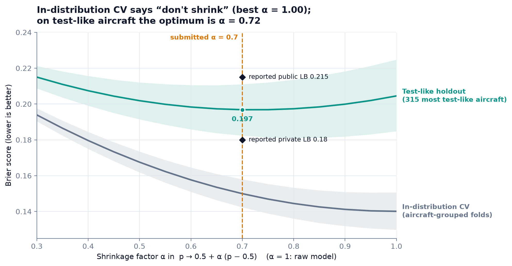
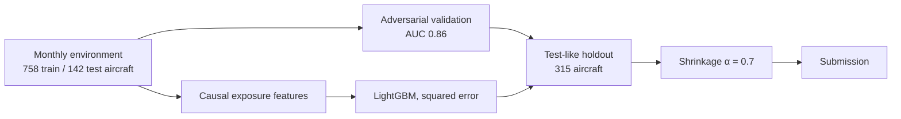
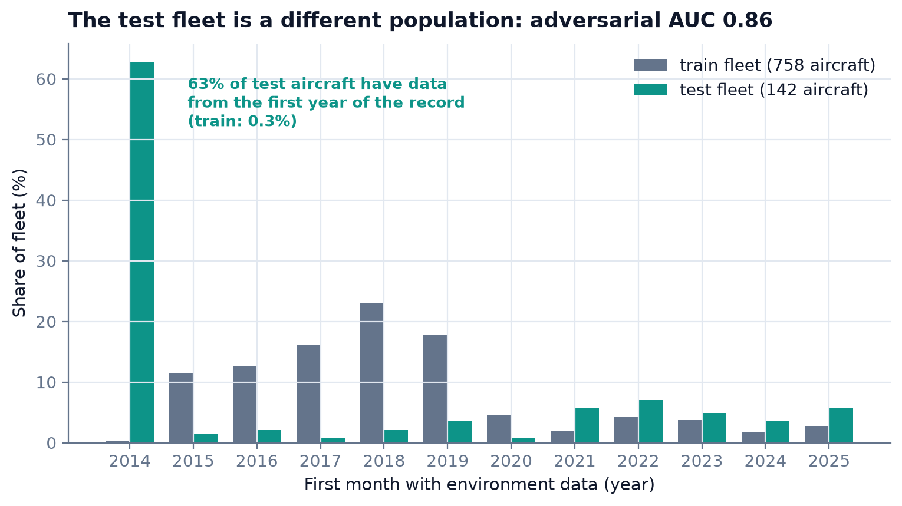
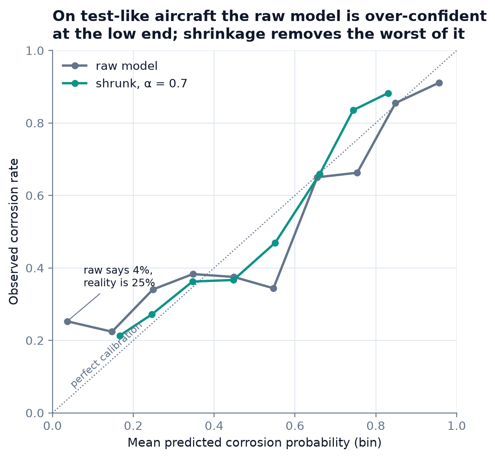
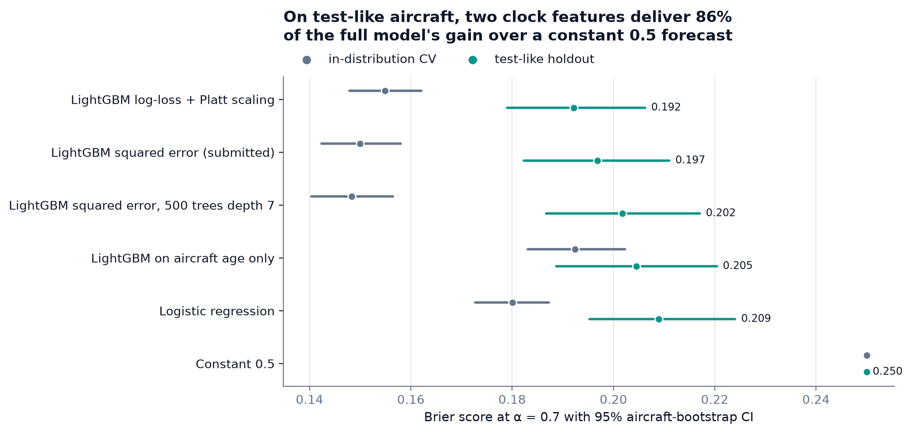
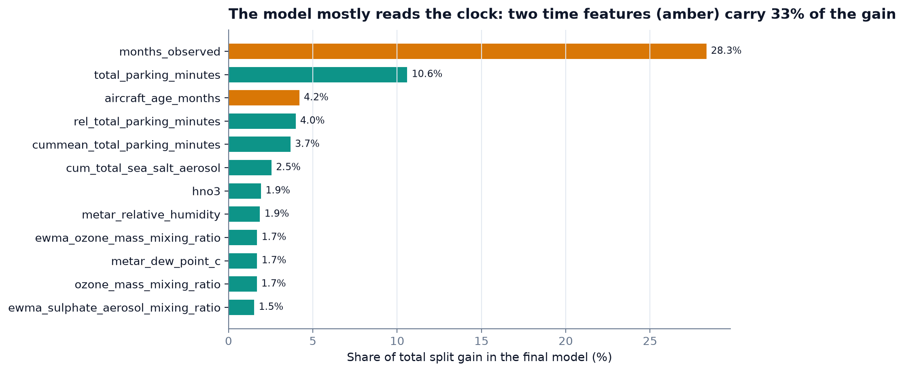
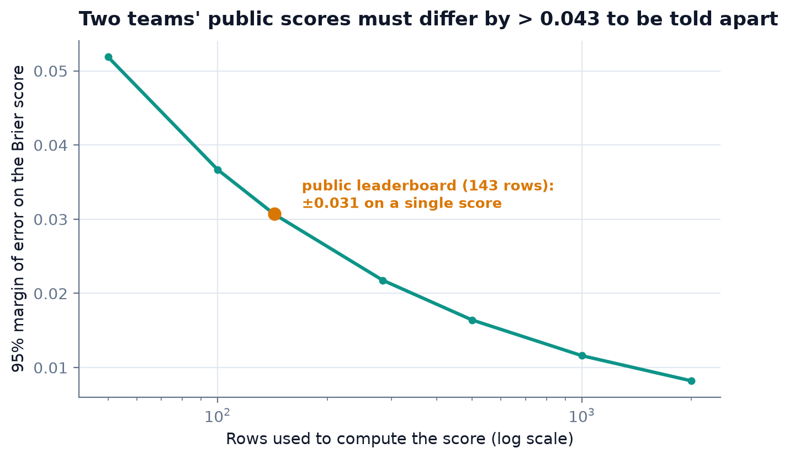

# AIRBUS-IBM-HACKATHON-2026

When the test fleet is not your training fleet: a corrosion-risk model for the Airbus × IBM × AWS 2026 hackathon, and the shift-aware validation that set its one decisive parameter.

[](https://github.com/Pchambet/AIRBUS-IBM-HACKATHON-2026/actions/workflows/ci.yml)

[](LICENSE)
[](https://pchambet.github.io/AIRBUS-IBM-HACKATHON-2026/)

*Version française : [README.fr.md](README.fr.md)*



**Outcome (as reported by the organisers):** 6th on the Kaggle Brier leaderboard and 2nd overall
(model + business pitch). The model moved from 22nd on the public leaderboard (Brier 0.215) to
6th on the private one (0.18). Team project; I was the ML lead and built the modelling and
validation pipeline in this repository. The business pitch was a team effort.

## TL;DR

- **The test fleet is a different population.** An aircraft-grouped adversarial classifier tells
  test rows from training rows with AUC **0.86**; 63% of test aircraft have data from the first
  year of the record, against 0.3% of training aircraft.
- **Grouped cross-validation is optimistic for this test fleet.** The raw model scores Brier **0.140**
  in grouped CV overall, **0.165** in the same CV on the 315 most test-like training aircraft, and
  **0.204** on those aircraft once they are left out of training. About 0.025 of the gap is "these
  aircraft are harder"; the other 0.039 comes from never having seen test-like aircraft (and a smaller
  training set).
- **One parameter matters.** Shrinking predictions toward 0.5, `p → 0.5 + α (p − 0.5)`, is useless
  in-distribution (optimal α = 1.00) but optimal at **α = 0.72** on test-like aircraft. The
  submitted α = 0.7 improves the holdout Brier by **0.008** (paired 95% CI 0.002–0.014) to **0.197**.
- **Most of the transferable signal is the clock.** On test-like aircraft, a model on two time
  features alone recovers most of the full 66-feature model's gain over a constant forecast (point
  estimate **86%**; its paired difference to the full model is not significant).
- **The public leaderboard was too small to rank on.** On 143 rows a Brier score carries a
  ±**0.031** margin of error. Two independent scores would need to differ by more than 0.043; a
  paired comparison on the same rows is tighter (about 0.011 for two similar models) but still coarse.

## Why it matters

Any risk model used for inspection planning must keep honest probabilities on aircraft it has never
seen, and that is exactly what breaks when the fleet you score differs from the fleet you learned
from. This repository shows how to detect that shift, measure what it costs and correct for it with a
validation set that looks like the target, rather than trusting cross-validation or a small public
leaderboard. The benchmark itself is narrower than inspection planning; see the limitations.

## Approach

1. **Read the scoring rule.** Only two months per aircraft are scored: the corrosion month T (1) and
   T − 24 months (0). Training on exactly those rows gives 1,270 balanced labels, and makes the task
   *within-aircraft*: anything constant per aircraft cancels out.
2. **Causal exposure features** (66): exponentially weighted aerosols, rolling weather, accumulated
   salt/sulphate/acid/parking dose, and the clock (months observed, age proxy). Every feature at month
   *m* uses months ≤ *m* only; a test guards it.
3. **Squared-error LightGBM** on the 0/1 label: the Brier score is the training loss.
4. **Measure the shift** with aircraft-grouped adversarial validation.
5. **Validate where it matters:** fit on the 384 least test-like training aircraft, score the 315 most
   test-like, with confidence intervals from a bootstrap over aircraft.
6. **Decide α** on that holdout (closed-form Brier-optimal shrinkage), and submit.



## Results


Most test aircraft are already in the record in its first year, so their "age" and cumulative doses
are left-censored: a population the training fleet barely covers.


On test-like aircraft the raw model is over-confident at the low end (it says 4%, the observed rate is
25%); shrinkage removes the worst of it without changing the ranking.

| Model, judged on the test-like holdout (α = 0.7) | Brier | 95% CI | Δ vs submitted (paired) | AUC |
|---|---|---|---|---|
| Constant 0.5 | 0.2500 | — | +0.0532 [+0.0390, +0.0676] | 0.500 |
| **LightGBM squared error (submitted)** | **0.1968** | [0.1824, 0.2110] | — | 0.766 |
| LightGBM log-loss + Platt scaling | 0.1922 | [0.1790, 0.2063] | −0.0046 [−0.0096, +0.0005] | 0.774 |
| LightGBM squared error, 500 trees depth 7 | 0.2018 | [0.1867, 0.2171] | +0.0050 [+0.0014, +0.0089] | 0.750 |
| Logistic regression | 0.2089 | [0.1953, 0.2240] | +0.0121 [+0.0011, +0.0235] | 0.737 |
| LightGBM on the two clock features | 0.2045 | [0.1887, 0.2204] | +0.0077 [−0.0067, +0.0226] | 0.740 |
| 10-model ensemble (5 seeds × 2 objectives) | 0.1929 | [0.1796, 0.2069] | −0.0039 [−0.0067, −0.0010] | 0.772 |

The objective (squared error versus log-loss + Platt) is within noise. A larger model fits the
training fleet harder and transfers worse. The ensemble is the only variant whose paired interval
excludes zero, narrowly, among the variants tried; it was not submitted. Dropping the 5, 10 or 15
most shift-revealing features changes the holdout Brier by +0.002 to −0.004, all within noise
([`results/levers_ood.csv`](results/levers_ood.csv)).


The two clock features carry most of what transfers to the shifted fleet; the environmental features
help much more in-distribution than out of it.


The final model agrees: months observed and the age proxy carry a third of the split gain, ahead of
parking time and the exposure doses.


With 143 public rows a single score is known to ±0.031, and two independent scores closer than 0.043
cannot be told apart (a paired comparison on the same rows is tighter, about 0.011 for two similar
models). The submission was therefore chosen on the holdout, not on public feedback.

**Leak audit.** Missingness at T differs from other months by at most 0.06 percentage points;
duplicated rows are about as common at T (7.6%) as elsewhere (6.0%); T is the last observed month for
only 1.8% of aircraft. Nothing exploitable.

**Reproducibility check.** `make train` regenerates the archived final submission file
(`final_submission_best.csv`, 14,303 rows) byte for byte on the machine used for this analysis
(SHA-256 `5650040577d7ebf99586c21f19af75aa0025a6f3d4ebabf08080e310ea186cd2`). Other platforms or
library builds may differ at machine precision (< 1e-16).

The full narrative, including the detours, is in [`docs/approach.md`](docs/approach.md) and in the
[interactive report](https://pchambet.github.io/AIRBUS-IBM-HACKATHON-2026/).

## Reproduce

```bash
make setup                          # uv sync --locked (Python 3.12)
make data                           # Kaggle CLI, or: make data SOURCE=/path/to/downloaded/files
make run                            # submission + all experiments + figures (about 2 min on a laptop)
make report                         # site/index.html
```

The competition data (about 55 MB) must be obtained from Kaggle after accepting its rules; see
[`data/README.md`](data/README.md). `make test` and `make lint` run without it (synthetic fixtures,
under a minute).

## Repository layout

```
src/corrosion_risk/
  data.py          locate / fetch the competition files
  features.py      causal per-aircraft exposure features
  target.py        T / T-24 labels that mirror the scoring rule
  model.py         LightGBM regressor + shrinkage
  validation.py    adversarial validation, test-like split, aircraft bootstrap, optimal α
  experiments.py   every number in this README -> results/
  figures.py       docs/figures/*.png from results/
  report.py        site/index.html from results/
  cli.py           `uv run corrosion-risk {data,train,analyze,figures,report}`
results/           small derived tables (CSV/JSON) behind every figure and number
docs/              approach.md, figures/
tests/             unit tests + ground-truth recovery on synthetic data
site/              generated report (GitHub Pages)
```

## Methodology notes and limitations

- **Leaderboard figures are reported, not reproduced.** Ranks and the public/private Brier scores
  come from the competition leaderboard; the hidden labels are not available.
- **The benchmark is not the operational question.** It contrasts T with T − 24 within each aircraft,
  so elapsed time is informative by construction. A good Brier here does not by itself show value for
  scheduling inspections, which would need every-month labels and a cost model.
- **One holdout split.** The test-like holdout is a single split of 315 aircraft. It is deliberately
  pessimistic (the model sees only 55% of the 699 labelled training aircraft) and was used to
  *choose* α, not to forecast the final score: its estimate (0.197) sits between the reported public
  (0.215) and private (0.18) scores.
- **Row versus aircraft weighting.** During the event the holdout was summarised per aircraft
  (about 0.21–0.22, which matched the public score); this re-analysis uses the leaderboard's row
  weighting. Matching a 143-row public score to three decimals was never informative.
- **Leaderboard margins are approximate.** They treat the 143 public rows as independent, but they come
  in T / T − 24 pairs from the same aircraft; the paired threshold depends on how similar two
  submissions are.
- **Age is a proxy.** The test set has no delivery date, so the first observed month stands in for
  it. For aircraft whose history starts with the record this is wrong, and it is one source of shift.
- **Multiple comparisons.** Several candidates were compared on the same holdout; small paired
  differences (|Δ| < 0.005) should be read as suggestive.
- **Physics stays crude.** EWMA half-life (12 months) and interaction terms are engineering choices,
  not fitted corrosion kinetics.

## References

- Airbus × IBM × AWS 2026 hackathon, Kaggle competition `haks-airbus-x-ibm-x-aws-2026` (data under
  the competition rules, not redistributed).
- G. W. Brier (1950). Verification of forecasts expressed in terms of probability. *Monthly Weather Review* 78(1).
- J. Platt (1999). Probabilistic outputs for support vector machines and comparisons to regularized likelihood methods.
- M. Sugiyama, M. Krauledat, K.-R. Müller (2007). Covariate shift adaptation by importance weighted cross validation. *JMLR* 8.
- G. Ke et al. (2017). LightGBM: a highly efficient gradient boosting decision tree. *NeurIPS*.

---

Built by [Pierre Chambet](https://github.com/Pchambet) — decision science for operations under uncertainty.
