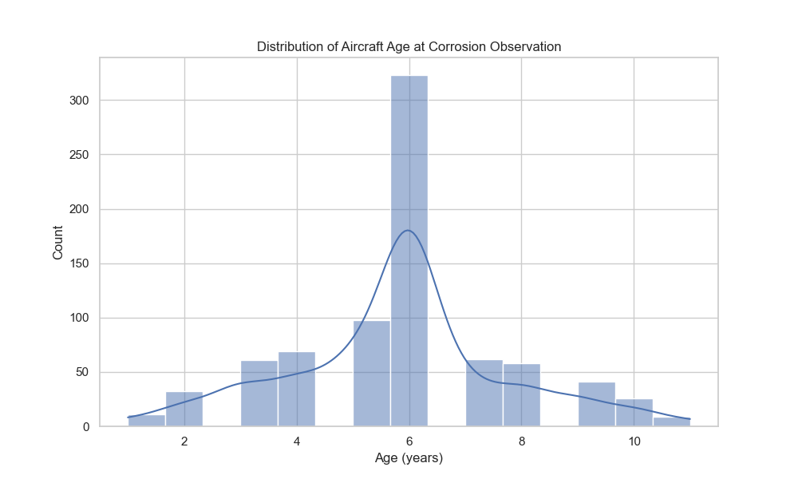
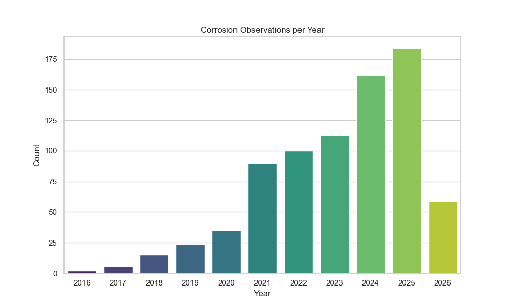
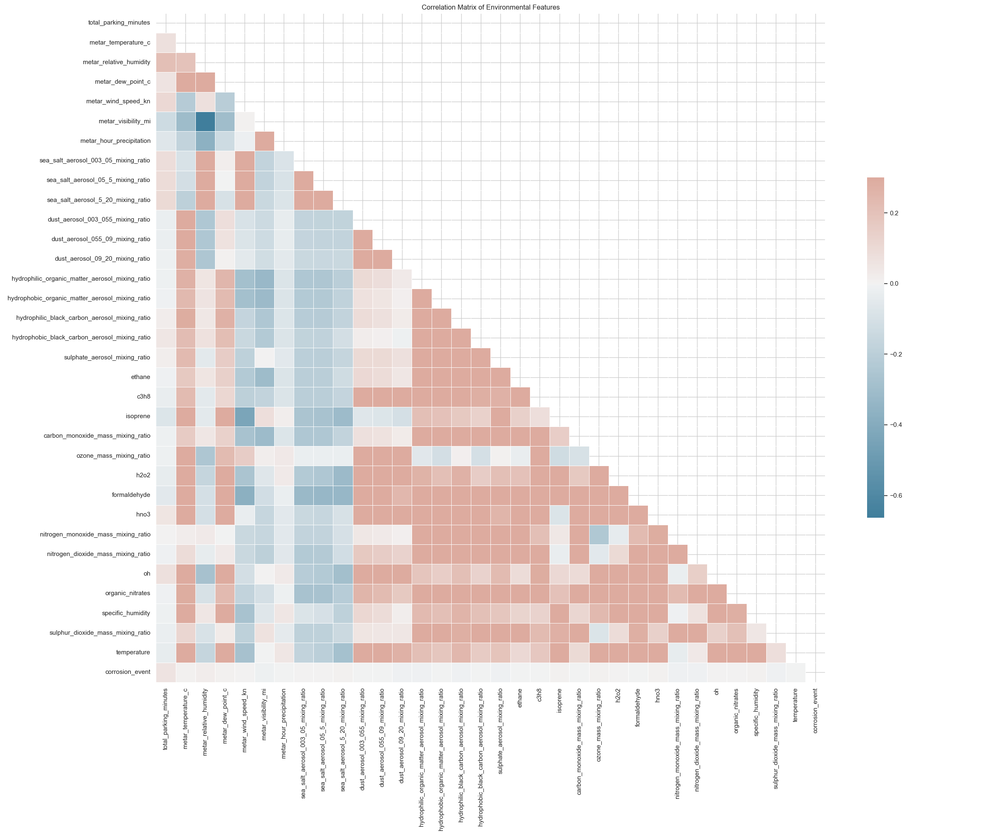
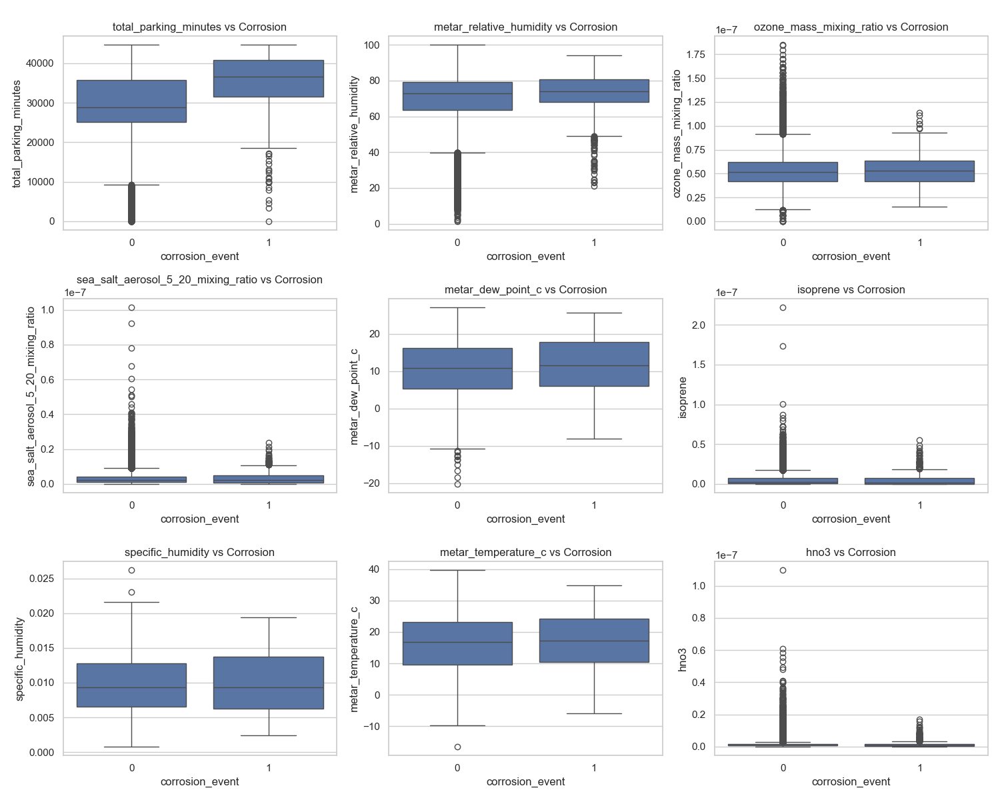

# Rapport d'Analyse Exploratoire des Données (EDA) - Airbus-IBM

Ce rapport présente les résultats de l'exploration approfondie des jeux de données `corrosions_training.csv` et `environment_training.csv`. L'objectif est de comprendre la structure des données, d'identifier les valeurs manquantes et de dégager des corrélations utiles pour la modélisation prédictive du risque de corrosion.

---

## 1. Qualité des Données et Valeurs Manquantes

Le jeu de données environnementales est globalement de très bonne qualité. Sur un total de **63 524 enregistrements**, nous n'avons relevé que de très faibles taux de valeurs manquantes :
- `metar_temperature_c` : 36 valeurs manquantes
- `metar_relative_humidity` : 37 valeurs manquantes
- `metar_dew_point_c` : 37 valeurs manquantes
- `metar_hour_precipitation` : 8 valeurs manquantes

> [!TIP]
> Ces valeurs manquantes représentent moins de 0.06% du jeu de données. Une simple imputation par la médiane ou la moyenne suffira amplement sans dégrader la qualité du futur modèle.

---

## 2. Analyse de la Variable Cible (Corrosion)

Le fichier `corrosions_training.csv` indique la date d'observation d'un incident de corrosion pour un avion spécifique. Pour notre modélisation, nous avons fusionné cette information avec le fichier environnemental.

- **Nombre d'observations de corrosion uniques dans l'ensemble de données d'entraînement :** 790
- **Événements de corrosion alignés sur les variables météorologiques mensuelles :** 616 mois-avions marqués avec `corrosion_event = 1`.

Cela signifie que notre jeu de données est fortement déséquilibré : seule une très petite fraction (environ 1%) des relevés mensuels correspond à une apparition de corrosion. 

> [!IMPORTANT]
> Pour l'apprentissage automatique, il faudra utiliser des techniques de gestion du déséquilibre des classes (comme SMOTE, un sous-échantillonnage de la classe majoritaire, ou l'utilisation d'une pondération des classes) afin d'éviter que le modèle ne prédise naïvement "0" partout.

### Graphiques des Observations

**Observations :**
- L'âge moyen d'un avion au moment de la détection de la corrosion est d'environ 6 à 8 ans. Cependant, certaines occurrences surviennent dès les premières années de mise en service.
- Une tendance à la hausse des détections est observée à partir de 2021, avec un pic significatif autour de 2024-2025. Cela peut être dû au vieillissement global de la flotte analysée ou à une amélioration des processus d'inspection.

---

## 3. Analyse des Corrélations

Afin de déterminer quels facteurs environnementaux favorisent la corrosion, nous avons mesuré les corrélations linéaires (coefficient de Pearson).

### Matrice de Corrélation Globale

> [!NOTE]
> Beaucoup de variables chimiques et d'aérosols sont très corrélées entre elles (ex: les différentes granulométries de sel de mer ou de poussière). Lors de la modélisation, une technique de réduction de dimension (comme la PCA) ou l'utilisation de modèles robustes à la colinéarité (Random Forest, XGBoost, LightGBM) sera judicieuse.

### Corrélations avec le Risque de Corrosion

Les corrélations linéaires directes (mois par mois) avec l'événement de corrosion sont très faibles :
- `total_parking_minutes` : +0.059
- `metar_relative_humidity` : +0.023
- `ozone_mass_mixing_ratio` : +0.008
- `sea_salt_aerosol_5_20_mixing_ratio` : +0.0078
- `metar_dew_point_c` : +0.0076

En revanche, certaines variables semblent avoir une légère corrélation négative (plus la valeur est élevée, moins l'événement survient dans ce mois) :
- `metar_visibility_mi` : -0.015
- `sulphur_dioxide_mass_mixing_ratio` : -0.009
- `nitrogen_dioxide_mass_mixing_ratio` : -0.008

> [!WARNING]
> La faible corrélation linéaire **ne signifie pas** qu'il n'y a pas de lien ! La corrosion est un processus **cumulatif**. Un mois de forte humidité ou de forte salinité marine ne déclenche pas immédiatement une corrosion visible. 
> 
> Il sera donc indispensable, pour la modélisation, de créer de nouvelles caractéristiques (Feature Engineering) :
> - Sommes cumulées (Cumulative Sum) de l'humidité, des sels marins, des temps de parking depuis la livraison de l'avion.
> - Moyennes glissantes sur les 12 ou 24 derniers mois.

---

## Conclusion et Prochaines Étapes (Feature Engineering & Modélisation)

Notre analyse en profondeur confirme que :
1. Les données sont propres, mais fortement déséquilibrées.
2. Les relations entre l'environnement et l'apparition de corrosion ne sont pas immédiates, d'où des corrélations linéaires instantanées très faibles.
3. Le temps passé au sol (`total_parking_minutes`) et l'humidité relative sont les facteurs instantanés qui se dégagent légèrement en tête.

**Recommandations pour la construction du modèle de Machine Learning :**
- Calculer des variables cumulatives (`cumulative_parking_minutes`, `average_humidity_since_delivery`, etc.).
- Inclure une variable `aircraft_age` dans les caractéristiques environnementales mensuelles.
- Utiliser un algorithme à base d'arbres (comme LightGBM ou XGBoost) capable de gérer nativement les valeurs manquantes et de capturer des relations non-linéaires complexes.
